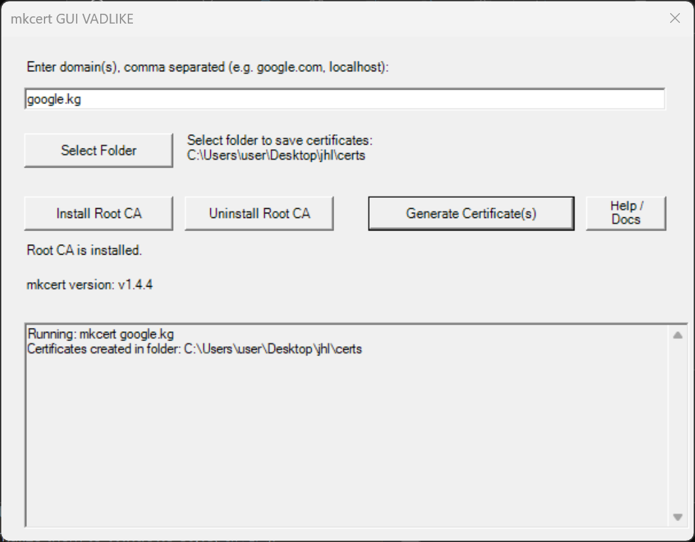

# mkcert-GUI 🛡️

A **Graphical User Interface (GUI)** for [mkcert](https://github.com/FiloSottile/mkcert) — the easiest way to create local SSL certificates with just a few clicks, no command-line knowledge required.

---

## 🔽 Download
👉 [Download the latest release](https://github.com/vadlike/mkcert-GUI-VADLIKE/releases)  
💡 Requires [mkcert](https://github.com/FiloSottile/mkcert#installation) to be installed.

---

## 🧰 Features

- Install root CA (`mkcert -install`)
- Generate SSL certificates for any domain
- Easy path and filename selection
- Supports multi-domain certificates
- Hides the CMD window for a clean experience
- Automatically creates a `certs` folder for output

---

## 📷 Screenshots

---

## ⚙️ Requirements

- Windows 10/11
- [mkcert](https://github.com/FiloSottile/mkcert)
- PowerShell (if using `.ps1` version)

---

## 👤 Author

- GUI & PowerShell script by [vadlike](https://github.com/vadlike)
- Based on the CLI tool [FiloSottile/mkcert](https://github.com/FiloSottile/mkcert)

---

## 📄 License

MIT
